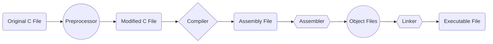

# Math and Flowcharts in Frappe
This repository is about rendering Math formula and Mermaid flowcharts in Frappe/Erpnext webpages through Markdown.

## Steps To Follow:

- Open terminal.
- Go to `utils` directory.
 
```bash
cd frappe-bench/apps/frappe/frappe/utils
vi data.py
```
- Add the following to `data.py`:

```python
    extras = {
        "fenced-code-blocks": None,
        "tables": None,
        "header-ids": None,
        "toc": None,
        "highlightjs-lang": None,
        "html-classes": {"table": "table table-bordered", "img": "screenshot"},
         "mermaid": None,
         "mathjax": None,
         "cuddled-lists": None,
         "code-friendly": None,
    }
```

- Now go to `templates` directory.

```bash
cd frappe-bench/apps/frappe/frappe/templates
vi web.html
```

- Add the following code to `web.html`:

```html
<script type="text/javascript" async
    src="https://cdnjs.cloudflare.com/ajax/libs/mathjax/2.7.4/MathJax.js?config=TeX-MML-AM_CHTML">
</script>
<script type="module" defer>
      import mermaid from
'https://cdn.jsdelivr.net/npm/mermaid@9/dist/mermaid.esm.min.mjs';
      mermaid.initialize({
        securityLevel: 'loose',
        startOnLoad: true
      });
      let observer = new MutationObserver(mutations => {
        for(let mutation of mutations) {
          mutation.target.style.visibility = "visible";
        }
      });
      document.querySelectorAll("pre.mermaid-pre div.mermaid").forEach(item => {
        observer.observe(item, {
          attributes: true,
          attributeFilter: ['data-processed'] });
      });
    </script>
```
- Save all the changes and create a webpage in Frappe.
- Through Markdown, using LaTeX syntax, render Math formula and make Mermaid flowcharts easily. 
- For example,

```markdown
$$A^2 + B^2$$

This is an organic chemical equation: $$C_6H_{12}O_6 + 6O_2 \\rightarrow 6CO_2 + 6H_2O$$

One more example:

$$\cos(2\theta) = \cos^2 \theta - \sin^2 \theta$$




- Output:


